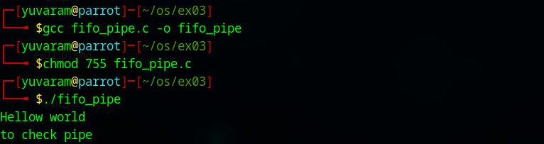

# Linux-IPC--Pipes
Linux-IPC-Pipes


# Ex03-Linux IPC - Pipes

# AIM:
To write a C program that illustrate communication between two process using unnamed and named pipes

# DESIGN STEPS:

### Step 1:

Navigate to any Linux environment installed on the system or installed inside a virtual environment like virtual box/vmware or online linux JSLinux (https://bellard.org/jslinux/vm.html?url=alpine-x86.cfg&mem=192) or docker.

### Step 2:

Write the C Program using Linux Process API - pipe(), fifo()

### Step 3:

Testing the C Program for the desired output. 

# PROGRAM:

## C Program that illustrate communication between two process using unnamed pipes using Linux API system calls
```
#include <stdio.h>
#include <stdlib.h>
#include <sys/types.h> 
#include <sys/stat.h> 
#include <string.h> 
#include <fcntl.h> 
#include <unistd.h>
#include <sys/wait.h>

void server(int, int); 
void client(int, int); 

int main() { 
    int p1[2], p2[2], pid; 
    pipe(p1); 
    pipe(p2); 
    pid = fork(); 

    if (pid == 0) { 
        // Child process - Server
        close(p1[1]); // Close write end of pipe1
        close(p2[0]); // Close read end of pipe2
        server(p1[0], p2[1]); 
        exit(0);
    } 

    // Parent process - Client
    close(p1[0]); // Close read end of pipe1
    close(p2[1]); // Close write end of pipe2
    client(p1[1], p2[0]); 
    
    wait(NULL); // Wait for child process to finish
    return 0; 
} 

void server(int rfd, int wfd) { 
    int n; 
    char fname[2000]; 
    char buff[2000];

    // Read filename from pipe
    n = read(rfd, fname, 2000);
    fname[n] = '\0';

    // Open the file
    int fd = open(fname, O_RDONLY);
    if (fd < 0) { 
        write(wfd, "can't open", 9); 
    } else { 
        n = read(fd, buff, 2000); 
        write(wfd, buff, n); 
        close(fd);
    } 
}

void client(int wfd, int rfd) {
    int n; 
    char fname[2000];
    char buff[2000];

    // Provide input filename
    scanf("%s", fname);

    // Send filename to server
    write(wfd, fname, 2000);

    // Read file contents from server
    n = read(rfd, buff, 2000);
    buff[n] = '\0';

    // Print file contents
    write(1, buff, n);
}
```

## OUTPUT


## C Program that illustrate communication between two process using named pipes using Linux API system calls

```
#include <stdio.h>
#include <stdlib.h>
#include <unistd.h>
#include <fcntl.h>
#include <sys/types.h>
#include <sys/stat.h>
#include <string.h>

#define FIFO_FILE "/tmp/my_fifo"
#define FILE_NAME "hello.txt"

void server();
void client();

int main() {
    pid_t pid;

    // Create FIFO if it doesn't exist
    mkfifo(FIFO_FILE, 0666);

    pid = fork();  // Create a child process

    if (pid > 0) {
        // Parent process acts as the server
        sleep(1);  // Ensure client is ready
        server();
    } else if (pid == 0) {
        // Child process acts as the client
        client();
    } else {
        perror("Fork failed");
        exit(EXIT_FAILURE);
    }

    return 0;
}

// Server: Reads from hello.txt and writes to FIFO
void server() {
    int fifo_fd, file_fd;
    char buffer[1024];
    ssize_t bytes_read;

    // Open the file to read
    file_fd = open(FILE_NAME, O_RDONLY);
    if (file_fd == -1) {
        perror("Error opening hello.txt");
        exit(EXIT_FAILURE);
    }

    // Open FIFO for writing
    fifo_fd = open(FIFO_FILE, O_WRONLY);
    if (fifo_fd == -1) {
        perror("Error opening FIFO");
        exit(EXIT_FAILURE);
    }

    // Read file and write to FIFO
    while ((bytes_read = read(file_fd, buffer, sizeof(buffer))) > 0) {
        write(fifo_fd, buffer, bytes_read);
    }

    close(file_fd);
    close(fifo_fd);
}

// Client: Reads from FIFO and prints the content
void client() {
    int fifo_fd;
    char buffer[1024];
    ssize_t bytes_read;

    // Open FIFO for reading
    fifo_fd = open(FIFO_FILE, O_RDONLY);
    if (fifo_fd == -1) {
        perror("Error opening FIFO");
        exit(EXIT_FAILURE);
    }

    // Read data from FIFO and print
    while ((bytes_read = read(fifo_fd, buffer, sizeof(buffer))) > 0) {
        write(STDOUT_FILENO, buffer, bytes_read);
    }

    close(fifo_fd);
}
```


## OUTPUT



# RESULT:
The program is executed successfully.
